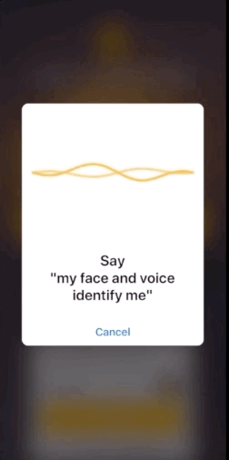
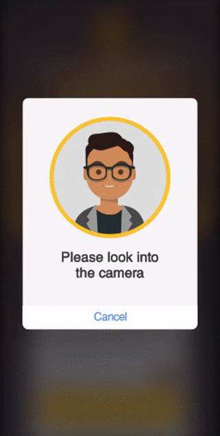
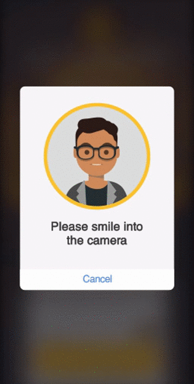
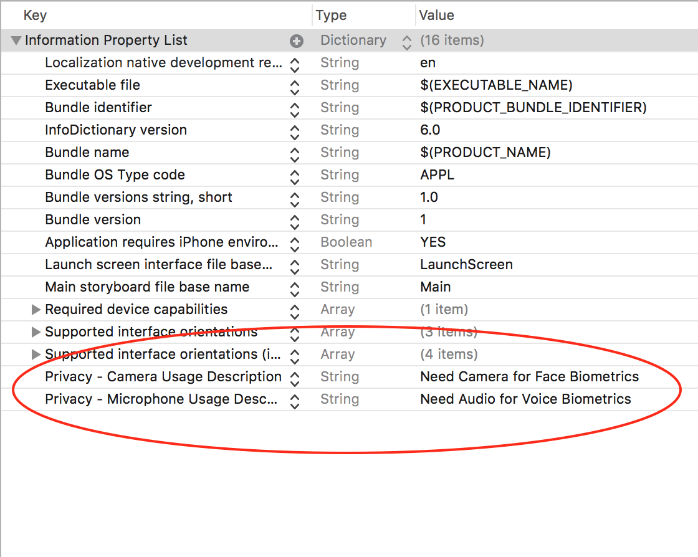

# VoiceIt2 iOS SDK [](http://cocoapods.org/pods/VoiceItApi2IosSDK) [](https://travis-ci.org/voiceittech/VoiceIt2-IosSDK)  [](http://cocoapods.org/pods/VoiceItApi2IosSDK)

A fully comprehensive SDK that gives you access to VoiceIt's API 2.0 featuring Voice + Face Verification and Identification with built in user interfaces and liveness detection.

## Table of Contents

* [UI Previews](#ui-previews)
* [Getting Started](#getting-started)
* [Installation](#installation)
* [Strings and Prompts](#strings-and-prompts)
* [API Calls](#api-calls)
  * [Initialization](#initialization)
  * [Encapsulated Methods](#encapsulated-methods)
      * [Encapsulated Voice Enrollment](#encapsulated-voice-enrollment)
      * [Encapsulated Face Enrollment](#encapsulated-face-enrollment)
      * [Encapsulated Video Enrollment](#encapsulated-video-enrollment)
      * [Encapsulated Voice Verification](#encapsulated-voice-verification)
      * [Encapsulated Face Verification](#encapsulated-face-verification)
      * [Encapsulated Video Verification](#encapsulated-video-verification)
      * [Encapsulated Voice Identification](#encapsulated-voice-identification)
      * [Encapsulated Face Identification](#encapsulated-face-identification)
      * [Encapsulated Video Identification](#encapsulated-video-identification)
  * [User API Calls](#user-api-calls)
      * [Get All Users](#get-all-users)
      * [Create User](#create-user)
      * [Check User Exists](#check-if-specific-user-exists)
      * [Get Groups for User](#get-groups-for-user)
      * [Delete User](#delete-a-specific-user)
  * [Group API Calls](#group-api-calls)
      * [Get All Groups](#get-all-groups)
      * [Get Group](#get-a-specific-group)
      * [Group exists](#check-if-group-exists)
      * [Create Group](#create-group)
      * [Add User to Group](#add-user-to-group)
      * [Remove User from Group](#remove-user-from-group)     
      * [Delete Group](#delete-group)
  * [Enrollment API Calls](#enrollment-api-calls)
      * [Get All Voice Enrollments](#get-all-voice-enrollments)
      * [Get All Face Enrollments](#get-all-face-enrollments)
      * [Get All Video Enrollments](#get-all-video-enrollments)
      * [Create Voice Enrollment](#create-voice-enrollment)
      * [Create Face Enrollment](#create-face-enrollment)
      * [Create Video Enrollment](#create-video-enrollment)
      * [Delete All Enrollments](#delete-all-enrollments)
  * [Verification API Calls](#verification-api-calls)
      * [Voice Verification](#voice-verification)
      * [Face Verification](#face-verification)
      * [Video Verification](#video-verification)
  * [Identification API Calls](#identification-api-calls)
      * [Voice Identification](#voice-identification)
      * [Video Identification](#video-identification)


## UI Previews
The following gifs show the UI for Voice Verification, Face Verification (With liveness detection on) and Video Verification (with Liveness turned off), respectively.

<div style="background: #000 !important;">
  
</div>

## Getting Started

Sign up for a free Developer Account at <a href="https://voiceit.io/signup" target="_blank">VoiceIt.io</a> and view your API Key and Token in the settings page (as shown below). You can also review the HTTP Documentation at <a href="https://api.voiceit.io" target="_blank">api.voiceit.io</a>.


## Installation

VoiceItApi2IosSDK is available through [CocoaPods](http://cocoapods.org). To install
it, simply add the following line to your Podfile:

```ruby
pod "VoiceItApi2IosSDK"
```

and then run pod install in your terminal

```bash
pod install
```

Also add the following permission keys to your <b>info.plist</b> file like shown below:

* NSCameraUsageDescription - Needed for Face Biometrics
* NSMicrophoneUsageDescription - Needed for Voice Biometrics



## Strings and Prompts

All strings utilized in the encapsulated views for the SDK and the prompts provided to the user can be modified by editing the strings in the Prompts.strings file located at

```
Pods/VoiceItApi2IosSDK/Resources/Prompts.strings
```
You might have to unlock the Cocoapod to edit the file.

## API Calls

### Initialization

#### *Swift*

First import *VoiceItApi2IosSDK* in your Swift file then initialize a reference to the SDK inside a ViewController, passing in a reference to the ViewController as the first argument, then the API Credentials, and finally a styles dictionary ( *kThemeColor* can be any hexadecimal color code and *kIconStyle* can be "default" or "monochrome").

```swift
import VoiceItApi2IosSDK

class ViewController: UIViewController {
    var myVoiceIt:VoiceItAPITwo?

    override func viewDidLoad() {
        super.viewDidLoad()
        /* Reference to ViewController , API Credentials and styles dictionary*/
        let styles = NSMutableDictionary(dictionary: ["kThemeColor":"#FBC132","kIconStyle":"default"])
        self.myVoiceIt = VoiceItAPITwo(self, apiKey: "API_KEY_HERE", apiToken: "API_TOKEN_HERE", styles: styles)
    }
}
```
#### *Objective-C*

First import *VoiceItAPITwo.h* into your Objective-C file, then initialize a reference to the SDK inside a ViewController, passing in a reference to the ViewController as the first argument.

```objc
#import "ViewController.h"
#import "VoiceItAPITwo.h"

@interface ViewController ()
    @property VoiceItAPITwo * myVoiceIt;
@end

@implementation ViewController

- (void)viewDidLoad {
    [super viewDidLoad];
    /* Reference to ViewController , API Credentials and styles dictionary*/
    NSMutableDictionary * styles = [[NSMutableDictionary alloc] init];
    [styles setObject:@"#FBC132" forKey:@"kThemeColor"];
    [styles setObject:@"default" forKey:@"kIconStyle"];
    self.myVoiceIt = [[VoiceItAPITwo alloc] init:self apiKey:@"API_KEY_HERE" apiToken:@"API_TOKEN_HERE" styles: styles];
}
```
### Encapsulated Methods

#### Encapsulated Voice Enrollment

Creates three voice enrollments for user with the given userId(begins with 'usr_') and contentLanguage('en-US','es-ES' etc.) and a given phrase such as "my face and voice identify me". Note: Immediately upon calling this method it displays the enrollment view controller that completely takes care of the three enrollments, including the UI, and provides relevant callbacks for whether the user cancelled their enrollments or successfully completed them.

##### *Swift*
```swift
myVoiceIt?.encapsulatedVoiceEnrollUser("USER_ID_HERE", contentLanguage: "CONTENT_LANGUAGE_HERE", voicePrintPhrase: "my face and voice identify me", userEnrollmentsCancelled: {
    print("User Enrollment Cancelled")
}, userEnrollmentsPassed: {
    print("User Enrollments Passed")
})
```

##### *Objective-C*
```objc
[self.myVoiceIt encapsulatedVoiceEnrollUser:@"USER_ID_HERE" contentLanguage:@"CONTENT_LANGUAGE_HERE" voicePrintPhrase:@"my face and voice identify me" userEnrollmentsCancelled:^{
    NSLog(@"User Enrollments Cancelled");
} userEnrollmentsPassed:^{
    NSLog(@"User Enrollments Passed");
}];
```

#### Encapsulated Face Enrollment

Creates a face enrollment for user with the given userId(begins with 'usr_'). Note: Immediately upon calling this method it displays the enrollment view controller that completely takes care of enrolling the user's face, including the UI, and provides relevant callbacks for whether the user cancelled their enrollment or successfully completed it.

##### *Swift*
```swift
myVoiceIt?.encapsulatedFaceEnrollUser("USER_ID_HERE", userEnrollmentsCancelled: {
    print("User Enrollment Cancelled")
}, userEnrollmentsPassed: {
    print("User Enrollments Passed")
})
```

##### *Objective-C*
```objc
[self.myVoiceIt encapsulatedFaceEnrollUser:@"USER_ID_HERE" userEnrollmentsCancelled:^{
    NSLog(@"User Enrollments Cancelled");
} userEnrollmentsPassed:^{
    NSLog(@"User Enrollments Passed");
}];
```

#### Encapsulated Video Enrollment

Creates three video enrollments for user with the given userId(begins with 'usr_') and contentLanguage('en-US','es-ES' etc.) and a given phrase such as "my face and voice identify me". Note: Immediately upon calling this method it displays the enrollment view controller that completely takes care of the three enrollments, including the UI, and provides relevant callbacks for whether the user cancelled their enrollments or successfully completed them.

##### *Swift*
```swift
myVoiceIt?.encapsulatedVideoEnrollUser("USER_ID_HERE", contentLanguage: "CONTENT_LANGUAGE_HERE", voicePrintPhrase: "my face and voice identify me", userEnrollmentsCancelled: {
    print("User Enrollment Cancelled")
}, userEnrollmentsPassed: {
    print("User Enrollments Passed")
})
```

##### *Objective-C*
```objc
[self.myVoiceIt encapsulatedVideoEnrollUser:@"USER_ID_HERE" contentLanguage:@"CONTENT_LANGUAGE_HERE" voicePrintPhrase:@"my face and voice identify me" userEnrollmentsCancelled:^{
    NSLog(@"User Enrollments Cancelled");
} userEnrollmentsPassed:^{
    NSLog(@"User Enrollments Passed");
}];
```

#### Encapsulated Voice Verification

Verify user with given userId(begins with 'usr_'). Note: Immediately upon calling this method it displays a view controller that records and verifies the user's voice and provides relevant callbacks for whether the verification was successful or not, and the associated voice confidence.

##### *Swift*
```swift
myVoiceIt?.encapsulatedVoiceVerification("USER_ID_HERE", contentLanguage: "CONTENT_LANGUAGE_HERE", voicePrintPhrase: "my face and voice identify me", userVerificationCancelled: {
    print("User Cancelled Verification");
}, userVerificationSuccessful: {(voiceConfidence, jsonResponse) in
    print("User Verication Successful, voiceConfidence : \(voiceConfidence)")
}, userVerificationFailed: { (voiceConfidence, jsonResponse) in
    print("User Verication Failed, voiceConfidence : \(voiceConfidence)")
})
```

##### *Objective-C*
```objc
[self.myVoiceIt encapsulatedVoiceVerification:@"USER_ID_HERE" contentLanguage:@"CONTENT_LANGUAGE_HERE" voicePrintPhrase:@"my face and voice identify me" userVerificationCancelled:^{
    NSLog(@"User Cancelled Verification");
} userVerificationSuccessful:^(float voiceConfidence, NSString * jsonResponse){
    NSLog(@"User Verication Successful, voiceConfidence : %g",voiceConfidence);
} userVerificationFailed:^(float faceConfidence, float voiceConfidence, NSString * jsonResponse){
    NSLog(@"User Verication Failed, voiceConfidence : %g",voiceConfidence);
}];
```

#### Encapsulated Face Verification

Verify user with given userId(begins with 'usr_') and a parameter to enable or disable liveness detection. Note: Immediately upon calling this method it displays a view controller with a camera preview that verifies the user's face and provides relevant callbacks for whether the verification was successful or not, and the associated face confidence.

##### *Swift*
```swift
myVoiceIt?.encapsulatedFaceVerification("USER_ID_HERE", doLivenessDetection:true, doAudioPrompts:true, userVerificationCancelled: {
    print("User Cancelled Verification");
}, userVerificationSuccessful: {(faceConfidence, jsonResponse) in
    print("User Verication Successful faceConfidence : \(faceConfidence)")
}, userVerificationFailed: { (faceConfidence, jsonResponse) in
    print("User Verication Failed, faceConfidence : \(faceConfidence)")
})
```

##### *Objective-C*
```objc
[self.myVoiceIt encapsulatedFaceVerification:@"USER_ID_HERE" doLivenessDetection:YES doAudioPrompts:YES userVerificationCancelled:^{
    NSLog(@"User Cancelled Verification");
} userVerificationSuccessful:^(float faceConfidence, NSString * jsonResponse){
    NSLog(@"User Verication Successful faceConfidence : %g", faceConfidence);
} userVerificationFailed:^(float faceConfidence, NSString * jsonResponse){
    NSLog(@"User Verication Failed, faceConfidence : %g",faceConfidence);
}];
```


#### Encapsulated Video Verification

Verify user with given userId(begins with 'usr_') , contentLanguage('en-US','es-ES' etc.) and a parameter to enable or disable liveness detection. Note: Immediately upon calling this method it displays a view controller with a camera preview that verifies the user and provides relevant callbacks for whether the verification was successful or not, and the associated voice and face confidences.

##### *Swift*
```swift
myVoiceIt?.encapsulatedVideoVerification("USER_ID_HERE", contentLanguage: "CONTENT_LANGUAGE_HERE", voicePrintPhrase: "my face and voice identify me", doLivenessDetection:true, doAudioPrompts:true, userVerificationCancelled: {
    print("User Cancelled Verification");
}, userVerificationSuccessful: {(faceConfidence, voiceConfidence, jsonResponse) in
    print("User Verication Successful, voiceConfidence : \(voiceConfidence), faceConfidence : \(faceConfidence)")
}, userVerificationFailed: { (faceConfidence, voiceConfidence, jsonResponse) in
    print("User Verication Failed, voiceConfidence : \(voiceConfidence), faceConfidence : \(faceConfidence)")
})
```

##### *Objective-C*
```objc
[self.myVoiceIt encapsulatedVideoVerification:@"USER_ID_HERE" contentLanguage:@"CONTENT_LANGUAGE_HERE" voicePrintPhrase:@"my face and voice identify me" doLivenessDetection:YES doAudioPrompts:YES userVerificationCancelled:^{
    NSLog(@"User Cancelled Verification");
} userVerificationSuccessful:^(float faceConfidence, float voiceConfidence, NSString * jsonResponse){
    NSLog(@"User Verication Successful, voiceConfidence : %g , faceConfidence : %g",voiceConfidence, faceConfidence);
} userVerificationFailed:^(float faceConfidence, float voiceConfidence, NSString * jsonResponse){
    NSLog(@"User Verication Failed, voiceConfidence : %g , faceConfidence : %g",voiceConfidence, faceConfidence);
}];
```

#### Encapsulated Voice Identification

Identify user in group with given groupId(begins with 'grp_'). Note: Immediately upon calling this method it displays a view controller that records and identifies the user's voice and provides relevant callbacks for whether the identification was successful or not, and the associated voice confidence.

##### *Swift*
```swift
myVoiceIt?.encapsulatedVoiceIdentification("GROUP_ID_HERE", contentLanguage: "CONTENT_LANGUAGE_HERE", voicePrintPhrase: "my face and voice identify me", userIdentificationCancelled: {
    print("User Cancelled Identification");
}, userIdentificationSuccessful: {(voiceConfidence, foundUserId, jsonResponse) in
    print("User Identification Successful, userId : \(foundUserId) voiceConfidence : \(voiceConfidence)")
}, userIdentificationFailed: { (voiceConfidence, jsonResponse) in
    print("User Identification Failed, voiceConfidence is \(voiceConfidence)")
})
```

##### *Objective-C*
```objc
[self.myVoiceIt encapsulatedVoiceIdentification:@"GROUP_ID_HERE" contentLanguage:@"CONTENT_LANGUAGE_HERE" voicePrintPhrase:@"my face and voice identify me" userIdentificationCancelled:^{
    NSLog(@"User Cancelled Identification");
} userIdentificationSuccessful:^(float voiceConfidence, NSString * foundUserId, NSString * jsonResponse){
    NSLog(@"User Identification Successful, userId: %@ voiceConfidence : %g",foundUserId, voiceConfidence);
} userIdentificationFailed:^(float faceConfidence, float voiceConfidence, NSString * jsonResponse){
    NSLog(@"User Identification Failed, voiceConfidence : %g",voiceConfidence);
}];
```

#### Encapsulated Face Identification

Identify a user in a group with a given groupId(begins with 'grp_') and a parameter to enable or disable liveness detection. Note: Immediately upon calling this method it displays a view controller with a camera preview that identifies the user's face and provides relevant callbacks for whether the identification was successful or not, and the associated face confidence.

##### *Swift*
```swift
myVoiceIt?.encapsulatedFaceIdentification("GROUP_ID_HERE", doLivenessDetection:true, doAudioPrompts:true, userIdentificationCancelled: {
    print("User Cancelled Identification");
}, userIdentificationSuccessful: {(faceConfidence, foundUserId, jsonResponse) in
    print("User Identification Successful userId : \(foundUserId) faceConfidence : \(faceConfidence)")
}, userIdentificationFailed: { (faceConfidence, jsonResponse) in
    print("User Identification Failed, faceConfidence is \(faceConfidence)")
})
```

##### *Objective-C*
```objc
[self.myVoiceIt encapsulatedFaceIdentification:@"GROUP_ID_HERE" doLivenessDetection:YES doAudioPrompts:YES userIdentificationCancelled:^{
    NSLog(@"User Cancelled Identification");
} userIdentificationSuccessful:^(float faceConfidence, NSString * foundUserId, NSString * jsonResponse){
    NSLog(@"User Identification Successful userId: %@ faceConfidence : %g", foundUserId, faceConfidence);
} userIdentificationFailed:^(float faceConfidence, NSString * jsonResponse){
    NSLog(@"User Identification Failed, faceConfidence : %g",faceConfidence);
}];
```


#### Encapsulated Video Identification

Identify user in group with given groupId(begins with 'grp_'), contentLanguage('en-US','es-ES' etc.)  and a parameter to enable or disable liveness detection. Note: Immediately upon calling this method it displays a view controller with a camera preview that identifies the user and provides relevant callbacks for whether the identification was successful or not, and the associated voice and face confidences.

##### *Swift*
```swift
myVoiceIt?.encapsulatedVideoIdentification("GROUP_ID_HERE", contentLanguage: "CONTENT_LANGUAGE_HERE", voicePrintPhrase: "my face and voice identify me", doLivenessDetection:true, doAudioPrompts:true, userIdentificationCancelled: {
    print("User Cancelled Identification");
}, userIdentificationSuccessful: {(faceConfidence, voiceConfidence, foundUserId, jsonResponse) in
    print("User Identification Successful, voiceConfidence is \(voiceConfidence), faceConfidence is \(faceConfidence)")
}, userIdentificationFailed: { (faceConfidence, voiceConfidence, jsonResponse) in
    print("User Identification Failed, voiceConfidence is \(voiceConfidence), faceConfidence is \(faceConfidence)")
})
```

##### *Objective-C*
```objc
[self.myVoiceIt encapsulatedVideoIdentification:@"GROUP_ID_HERE" contentLanguage:@"CONTENT_LANGUAGE_HERE" voicePrintPhrase:@"my face and voice identify me" doLivenessDetection:YES doAudioPrompts:YES userIdentificationCancelled:^{
    NSLog(@"User Cancelled Identification");
} userIdentificationSuccessful:^(float faceConfidence, float voiceConfidence, NSString * foundUserId, NSString * jsonResponse){
    NSLog(@"User Identification Successful, userId: %@, voiceConfidence : %g , faceConfidence : %g", foundUserId, voiceConfidence, faceConfidence);
} userIdentificationFailed:^(float faceConfidence ,float voiceConfidence, NSString * jsonResponse){
    NSLog(@"User Identification Failed, voiceConfidence : %g , faceConfidence : %g",voiceConfidence, faceConfidence);
}];
```

### User API Calls

#### Get All Users

Get all users associated with the apiKey

##### *Swift*
```swift
myVoiceIt?.getAllUsers({
    jsonResponse in
    print("JSON RESPONSE: \(jsonResponse!)")
})
```
##### *Objective-C*
```objc
[self.myVoiceIt getAllUsers:^(NSString * jsonResponse){
    NSLog(@"JSONResponse: %@", jsonResponse);
}];
```

#### Create User

Create a new user

##### *Swift*
```swift
myVoiceIt?.createUser({
    jsonResponse in
    print("JSON RESPONSE: \(jsonResponse!)")
})
```
##### *Objective-C*
```objc
[self.myVoiceIt createUser:^(NSString * jsonResponse){
    NSLog(@"JSONResponse: %@", jsonResponse);
}];
```

#### Check if Specific User Exists

Check whether a user exists for given userId(begins with 'usr_')

##### *Swift*
```swift
myVoiceIt?.checkUserExists("USER_ID_HERE", callback: {
    jsonResponse in
    print("JSON RESPONSE: \(jsonResponse!)")
})
```
##### *Objective-C*
```objc
[self.myVoiceIt checkUserExists:@"USER_ID_HERE" callback:^(NSString * jsonResponse){
    NSLog(@"JSONResponse: %@", jsonResponse);
}];
```

#### Get Groups for User

Get a list of groups that the user with the given userId(begins with 'usr_') is a part of

##### *Swift*
```swift
myVoiceIt?.getGroupsForUser("USER_ID_HERE", callback: {
    jsonResponse in
    print("JSON RESPONSE: \(jsonResponse!)")
})
```
##### *Objective-C*
```objc
[self.myVoiceIt getGroupsForUser:@"USER_ID_HERE" callback:^(NSString * jsonResponse){
    NSLog(@"JSONResponse: %@", jsonResponse);
}];
```

#### Delete a Specific User

Delete user with given userId(begins with 'usr_')

##### *Swift*
```swift
myVoiceIt?.deleteUser("USER_ID_HERE", callback: {
    jsonResponse in
    print("JSON RESPONSE: \(jsonResponse!)")
})
```
##### *Objective-C*
```objc
[self.myVoiceIt deleteUser:@"USER_ID_HERE" callback:^(NSString * jsonResponse){
    NSLog(@"JSONResponse: %@", jsonResponse);
}];
```

### Group API Calls

#### Get All Groups

Get all groups associated with apiKey

##### *Swift*
```swift
myVoiceIt?.getAllGroups({
    jsonResponse in
    print("JSON RESPONSE: \(jsonResponse!)")
})
```
##### *Objective-C*
```objc
[self.myVoiceIt getAllGroups:^(NSString * jsonResponse){
    NSLog(@"JSONResponse: %@", jsonResponse);
}];
```

#### Get a Specific Group

Returns a group for the given groupId(begins with 'grp_')

##### *Swift*
```swift
myVoiceIt?.getGroup("GROUP_ID_HERE", callback: {
    jsonResponse in
    print("JSON RESPONSE: \(jsonResponse!)")
})
```
##### *Objective-C*
```objc
[self.myVoiceIt getGroup:@"GROUP_ID_HERE" callback:^(NSString * jsonResponse){
    NSLog(@"JSONResponse: %@", jsonResponse);
}];
```

#### Check if Group Exists

Checks if group with given groupId(begins with 'grp_') exists

##### *Swift*
```swift
myVoiceIt?.groupExists("GROUP_ID_HERE", callback: {
    jsonResponse in
    print("JSON RESPONSE: \(jsonResponse!)")
})
```

##### *Objective-C*
```objc
[self.myVoiceIt groupExists:@"GROUP_ID_HERE" callback:^(NSString * jsonResponse){
    NSLog(@"JSONResponse: %@", jsonResponse);
}];
```

#### Create Group

Create a new group with the given description

##### *Swift*
```swift
myVoiceIt?.createGroup("A Sample Group Description", callback: {
    jsonResponse in
})
```
##### *Objective-C*
```objc
[self.myVoiceIt createGroup:@"A Sample Group Description" callback:^(NSString * jsonResponse){
    NSLog(@"JSONResponse: %@", jsonResponse);
}];
```

#### Add User to Group

Adds user with given userId(begins with 'usr_') to group with given groupId(begins with 'grp_')

##### *Swift*
```swift
myVoiceIt?.addUser(toGroup: "GROUP_ID_HERE", userId: "USER_ID_HERE", callback: {
    jsonResponse in
    print("JSON RESPONSE: \(jsonResponse!)")
})
```

##### *Objective-C*
```objc
[self.myVoiceIt addUserToGroup:@"GROUP_ID_HERE" userId:@"USER_ID_HERE" callback:^(NSString * jsonResponse){
            NSLog(@"JSONResponse: %@", jsonResponse);
}];
```

#### Remove User from Group

Removes user with given userId(begins with 'usr_') from group with given groupId(begins with 'grp_')

##### *Swift*
```swift
myVoiceIt?.removeUser(fromGroup: "GROUP_ID_HERE", userId: "USER_ID_HERE", callback: {
    jsonResponse in
    print("JSON RESPONSE: \(jsonResponse!)")
})
```

##### *Objective-C*
```objc
[self.myVoiceIt removeUserFromGroup:@"GROUP_ID_HERE" userId:@"USER_ID_HERE" callback:^(NSString * jsonResponse){
    NSLog(@"JSONResponse: %@", jsonResponse);
}];
```

#### Delete Group

Delete group with given groupId(begins with 'grp_'), note: This call does not delete any users, but simply deletes the group and disassociates the users from the group.

##### *Swift*
```swift
myVoiceIt?.deleteGroup("GROUP_ID_HERE", callback: {
    jsonResponse in
    print("JSON RESPONSE: \(jsonResponse!)")
})
```

##### *Objective-C*
```objc
[self.myVoiceIt deleteGroup:@"GROUP_ID_HERE" callback:^(NSString * jsonResponse){
    NSLog(@"JSONResponse: %@", jsonResponse);
}];
```

### Enrollment API Calls

#### Get All Voice Enrollments

Gets all voice enrollments for user with given userId(begins with 'usr_')

##### *Swift*
```swift
myVoiceIt?.getAllVoiceEnrollments("USER_ID_HERE", callback: {
    jsonResponse in
    print("JSON RESPONSE: \(jsonResponse!)")
})
```

##### *Objective-C*
```objc
[self.myVoiceIt getAllVoiceEnrollments:@"USER_ID_HERE" callback:^(NSString * jsonResponse){
    NSLog(@"JSONResponse: %@", jsonResponse);
}];
```

#### Get All Face Enrollments

Gets all face enrollments for user with given userId(begins with 'usr_')

##### *Swift*
```swift
myVoiceIt?.getAllFaceEnrollments("USER_ID_HERE", callback: {
jsonResponse in
    print("JSON RESPONSE: \(jsonResponse!)")
})
```

##### *Objective-C*
```objc
[self.myVoiceIt getAllFaceEnrollments:@"USER_ID_HERE" callback:^(NSString * jsonResponse){
    NSLog(@"JSONResponse: %@", jsonResponse);
}];
```

#### Get All Video Enrollments

Gets all video enrollments for user with given userId(begins with 'usr_')

##### *Swift*
```swift
myVoiceIt?.getAllVideoEnrollments("USER_ID_HERE", callback: {
jsonResponse in
    print("JSON RESPONSE: \(jsonResponse!)")
})
```

##### *Objective-C*
```objc
[self.myVoiceIt getAllVideoEnrollments:@"USER_ID_HERE" callback:^(NSString * jsonResponse){
    NSLog(@"JSONResponse: %@", jsonResponse);
}];
```

#### Create Voice Enrollment

Creates voice enrollment for user with given userId(begins with 'usr_') , contentLanguage('en-US','es-ES' etc.), approved phrase from the developer account, and audio file.

##### *Swift*
```swift
myVoiceIt?.createVoiceEnrollment("USER_ID_HERE", contentLanguage: "CONTENT_LANGUAGE_HERE", audioPath: "FILE_PATH_TO_VOICE_ENROLLMENT_HERE", phrase: "VOICEPRINT_PHRASE_HERE", callback: {
    jsonResponse in
    print("JSON RESPONSE: \(jsonResponse!)")
})
```

##### *Objective-C*
```objc
[self.myVoiceIt createVoiceEnrollment:@"USER_ID_HERE" contentLanguage: @"CONTENT_LANGUAGE_HERE" audioPath: @"FILE_PATH_TO_VOICE_ENROLLMENT_HERE" phrase: @"VOICEPRINT_PHRASE_HERE" callback:^(NSString * jsonResponse){
    NSLog(@"JSONResponse: %@", jsonResponse);
} ];
```

#### Create Face Enrollment

Create face enrollment for user with given userId(begins with 'usr_') and video file.
##### *Swift*
```swift
myVoiceIt?.createFaceEnrollment("USER_ID_HERE", videoPath: "FILE_PATH_TO_FACE_ENROLLMENT_HERE", callback: {
    jsonResponse in
    print("JSON RESPONSE: \(jsonResponse!)")
})
```

##### *Objective-C*
```objc
[self.myVoiceIt createFaceEnrollment:@"USER_ID_HERE" videoPath: @"FILE_PATH_TO_FACE_ENROLLMENT_HERE" callback:^(NSString * jsonResponse){
    NSLog(@"JSONResponse: %@", jsonResponse);
} ];
```

#### Create Video Enrollment

Creates video enrollment for user with given userId(begins with 'usr_') , contentLanguage('en-US','es-ES' etc.), approved phrase from the developer account, and video file.

##### *Swift*
```swift
myVoiceIt?.createVideoEnrollment("USER_ID_HERE", contentLanguage: "CONTENT_LANGUAGE_HERE", videoPath: "FILE_PATH_TO_VIDEO_ENROLLMENT_HERE", phrase: "VOICEPRINT_PHRASE_HERE", callback: {
    jsonResponse in
    print("JSON RESPONSE: \(jsonResponse!)")
})
```

##### *Objective-C*
```objc
[self.myVoiceIt createVideoEnrollment:@"USER_ID_HERE" contentLanguage: @"CONTENT_LANGUAGE_HERE" videoPath: @"FILE_PATH_TO_VIDEO_ENROLLMENT_HERE" phrase: @"VOICEPRINT_PHRASE_HERE" callback:^(NSString * jsonResponse){
    NSLog(@"JSONResponse: %@", jsonResponse);
} ];
```
#### Delete All Enrollments

Delete all enrollments for user with given userId(begins with 'usr_')

##### *Swift*
```swift
myVoiceIt?.deleteAllEnrollments("USER_ID_HERE", callback: {
    jsonResponse in
    print("JSON RESPONSE: \(jsonResponse!)")
})
```

##### *Objective-C*
```objc
[self.myVoiceIt deleteAllEnrollments:@"USER_ID_HERE" callback:^(NSString * jsonResponse){
    NSLog(@"JSONResponse: %@", jsonResponse);
}];
```

### Verification API Calls

#### Voice Verification

Verify user's voice with given userId(begins with 'usr_') , contentLanguage('en-US','es-ES' etc.), approved phrase from  developer account, and audio file.

##### *Swift*
```swift
myVoiceIt?.voiceVerification("USER_ID_HERE", contentLanguage: "CONTENT_LANGUAGE_HERE", audioPath: "FILE_PATH_TO_VOICE_FOR_VERIFICATION_HERE", phrase: "VOICEPRINT_PHRASE_HERE", callback: {
    jsonResponse in
    print("JSON RESPONSE: \(jsonResponse!)")
})
```

##### *Objective-C*
```objc
[self.myVoiceIt voiceVerification:@"USER_ID_HERE" contentLanguage:@"CONTENT_LANGUAGE_HERE" audioPath: @"FILE_PATH_TO_VOICE_FOR_VERIFICATION_HERE" phrase: @"VOICEPRINT_PHRASE_HERE" callback:^(NSString * jsonResponse){
    NSLog(@"JSONResponse: %@", jsonResponse);
} ];
```

#### Face Verification

Verify user's face with given userId(begins with 'usr_') and video file.

##### *Swift*
```swift
myVoiceIt?.faceVerification("USER_ID_HERE", videoPath: "FILE_PATH_TO_VIDEO_FOR_FACE_VERIFICATION_HERE", callback: {
    jsonResponse in
    print("JSON RESPONSE: \(jsonResponse!)")
})
```

##### *Objective-C*
```objc
[self.myVoiceIt faceVerification:@"USER_ID_HERE" videoPath: @"FILE_PATH_TO_VIDEO_FOR_FACE_VERIFICATION_HERE" callback:^(NSString * jsonResponse){
    NSLog(@"JSONResponse: %@", jsonResponse);
} ];
```

#### Video Verification

Verify user's face and voice with given userId(begins with 'usr_') , contentLanguage('en-US','es-ES' etc.), approved phrase from  developer account, and video file.

##### *Swift*
```swift
myVoiceIt?.videoVerification("USER_ID_HERE", contentLanguage: "CONTENT_LANGUAGE_HERE", videoPath: "FILE_PATH_TO_VIDEO_FOR_VERIFICATION_HERE", phrase: "VOICEPRINT_PHRASE_HERE", callback: {
    jsonResponse in
    print("JSON RESPONSE: \(jsonResponse!)")
})
```

##### *Objective-C*
```objc
[self.myVoiceIt videoVerification:@"USER_ID_HERE" contentLanguage:@"CONTENT_LANGUAGE_HERE" videoPath: @"FILE_PATH_TO_VIDEO_FOR_VERIFICATION_HERE" phrase: @"VOICEPRINT_PHRASE_HERE" callback:^(NSString * jsonResponse){
    NSLog(@"JSONResponse: %@", jsonResponse);
} ];
```

### Identification API Calls

#### Voice Identification

Identify user's voice  inside group with the given groupId(begins with 'grp_') and contentLanguage('en-US','es-ES' etc.), and approved phrase from developer account, and audioFile.

##### *Swift*
```swift
myVoiceIt?.voiceIdentification("GROUP_ID_HERE", contentLanguage: "CONTENT_LANGUAGE_HERE", audioPath: "FILE_PATH_TO_VOICE_FOR_IDENTIFICATION_HERE", phrase: "VOICEPRINT_PHRASE_HERE", callback: {
    jsonResponse in
    print("JSON RESPONSE: \(jsonResponse!)")
})
```

##### *Objective-C*
```objc
[self.myVoiceIt voiceIdentification:@"GROUP_ID_HERE" contentLanguage:@"CONTENT_LANGUAGE_HERE" audioPath: @"FILE_PATH_TO_VOICE_FOR_IDENTIFICATION_HERE"
phrase: @"VOICEPRINT_PHRASE_HERE" callback:^(NSString * jsonResponse){
    NSLog(@"JSONResponse: %@", jsonResponse);
} ];
```

#### Face Identification

Identify user' face inside group with the given groupId(begins with 'grp_') and videoFile.

##### *Swift*
```swift
myVoiceIt?.faceIdentification("GROUP_ID_HERE", videoPath: "FILE_PATH_TO_VIDEO_FOR_IDENTIFICATION_HERE",
    jsonResponse in
    print("JSON RESPONSE: \(jsonResponse!)")
})
```

##### *Objective-C*
```objc
[self.myVoiceIt faceIdentification:@"GROUP_ID_HERE" videoPath: @"FILE_PATH_TO_VIDEO_FOR_IDENTIFICATION_HERE" callback:^(NSString * jsonResponse){
    NSLog(@"JSONResponse: %@", jsonResponse);
} ];
```

#### Video Identification

Identify user's voice  and face inside group with the given groupId(begins with 'grp_') and contentLanguage('en-US','es-ES' etc.), and approved phrase from developer account, and videoFile.

##### *Swift*
```swift
myVoiceIt?.videoIdentification("GROUP_ID_HERE", contentLanguage: "CONTENT_LANGUAGE_HERE", videoPath: "FILE_PATH_TO_VIDEO_FOR_IDENTIFICATION_HERE", phrase: "VOICEPRINT_PHRASE_HERE", callback: {
    jsonResponse in
    print("JSON RESPONSE: \(jsonResponse!)")
})
```

##### *Objective-C*
```objc
[self.myVoiceIt videoIdentification:@"GROUP_ID_HERE" contentLanguage:@"CONTENT_LANGUAGE_HERE" videoPath: @"FILE_PATH_TO_VIDEO_FOR_IDENTIFICATION_HERE" phrase: @"VOICEPRINT_PHRASE_HERE" callback:^(NSString * jsonResponse){
    NSLog(@"JSONResponse: %@", jsonResponse);
} ];
```

## Author

VoiceIt Technologies, support@voiceit.io

## License

VoiceItApi2IosSDK is available under the MIT license. See the LICENSE file for more info.
